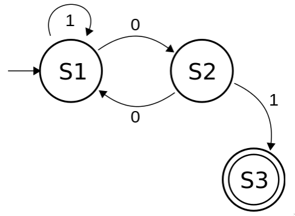
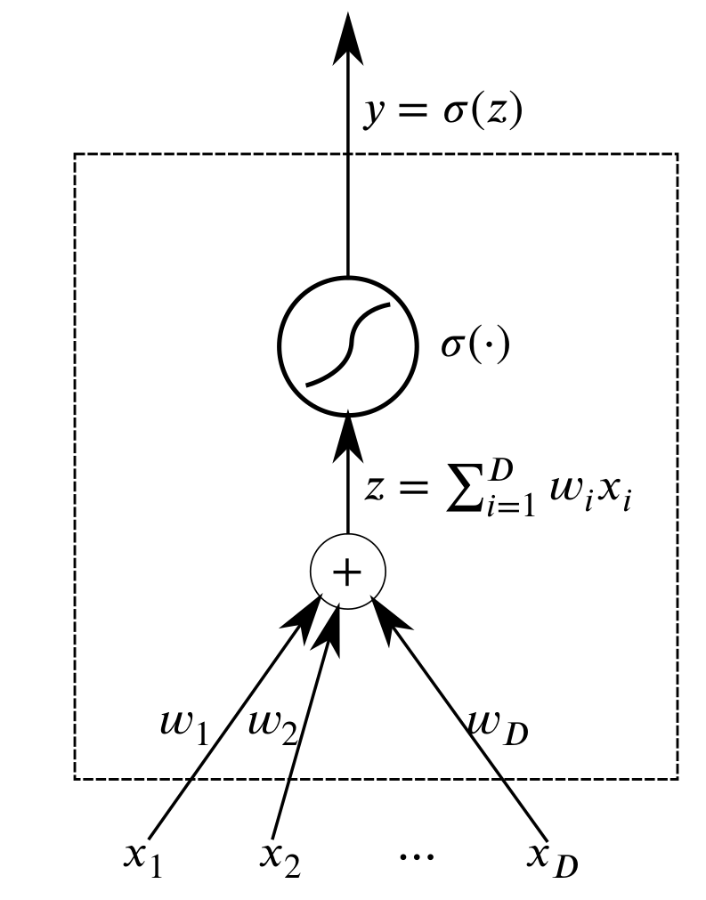

### AI, Speech Recognition, ML, NLP
#### Breaking down a dialogue system

Feynman Liang, Gigster, 15 Nov 2017

===

### Running example

---

### Agenda

 * Symbolic AI
   * Discrete finite automata (DFA)
 * Automatic speech recognition (ASR)
  * Classification, overfitting, bias-variance tradeoff
  * Deep / recurrent neural networks (DNNs/RNNs)
 * Semantic decoding / natural language understanding (NLU)
 * ~~Multi-turn dialogue management~~
 * ~~Response generation~~

===

## Symbolic AI: simple dialogue systems

---

### Deterministic finite automata (DFA)

 * $Q$, finite set of states
 * $\Sigma$, alphabet (transitions)

---

### Rule-based systems: vending machine

<!-- .element height="75%" width="75%" -->

---

### Rule-based systems: TCP

<!-- .element height="50%" width="50%" -->

---

### Rule-based systems: Pacman AI

---

<iframe width="560" height="315" src="https://www.youtube.com/embed/M1CEEqepTGg" frameborder="0" allowfullscreen></iframe>

---

### Eliza (Weizenbaum 1996)

 * Input sentences by decomposition rules triggered by key words appearing.
 * Responses generated by reassembly rules associated with selected decomposition rules.

[DEMO: Eliza](http://psych.fullerton.edu/mbirnbaum/psych101/Eliza.htm)

===

## Speech Recognition

---

### From audio waveforms to unstructured text

---

### Bayes Rule

$$P(Y | X) = \frac{P(X | Y) P(Y)}{P(X)} \propto P(X | Y) P(Y)$$

---

### Bayes Rule in speech recognition

$$P(words | speech)$$
$$\propto P(speech | words) P(words)$$

 * $P(speech | words)$, acoustic model
 * $P(words)$, language model

===

## Aside: classification

---

### Classiciation

Given **data** $x\_i \in \mathbb{R}^d$

and **labels** $y\_i \in \\{1,2,\ldots,K\\}$

"learn" a "good" **classifier** $f : \mathbb{R}^d \to \\{1,2,\ldots,K\\}$

---

### Example

Given speech (acoustic frame), classify the word (phoneme)

---

### Example: classifying handwritten numbers

<!-- .element height="75%" width="75%" -->

---

### Typical supervised learning pipeline

<!-- .element height="75%" width="75%" -->

---

### What is "good"?

Typically measured through a **loss function** $L(f(x\_i), y\_i)$

---

### Example: mean absolute error

$L(f(x\_i), y\_i) = \lvert f(x\_i) - y\_i \rvert$

<!-- .element height="75%" width="75%" -->

---

### How to "learn"?

Optimize: if $\theta$ are the parameters of the model, solve

$\text{argmin}\_\theta \sum\_i L(f\_\theta(x\_i), y\_i)$

---

### Gradient descent optimization

---

### Overfitting

<!-- .element height="40%" width="40%" -->
vs

<!-- .element height="40%" width="40%" -->

---

### With great power comes great responsibility

---

### Control your overfitting: bias-variance tradeoff

===

## Aside: Deep Neural Networks

---

## State of the art in speech

<!-- .element height="75%" width="75%" -->

---

### Neurons

<!-- .element height="40%" width="40%" -->

---

### Neural networks

<!-- .element height="50%" width="50%" -->

---

### In matrix notation

$$y^{(l)} = \sigma(W^{(l)} y^{(l-1)})$$

$$h^{(0)} = x$$

Optimize $\theta = \\{W^{(l)}\\}\_{l=1}^L$.

---

### DNN acoustic model $P(words | speech)$

---

### Example: training a neural net

[DEMO: Tensorflow playground](http://playground.tensorflow.org/)

---

### Convenient APIs: clarifai

[DEMO: Clarifai DNN image recognition](https://www.clarifai.com/demo)

===

### Language modelling $P(words)$

Probability distributions over sequences (of words).

---

### Standard assumption: Markov property

$P(w\_{1:L}) = \prod\_{i=1}^L P(w\_i | w\_{1:i-1})$

---

### $n$-gram models

$P(w\_i | w\_{1:i-1}) = P(w\_i | w\_{i-1})$

$P(w\_i | w\_{i-1}) = \frac{P(w\_i, w\_{i-1})}{\sum\_{\tilde{w}} P(w\_i, \tilde{w})}$

---

[DEMO: NGram analyzer](http://guidetodatamining.com/ngramAnalyzer/)

[DEMO: NGram generator](https://blog.algorithmia.com/playing-with-n-grams/)

---

### Recurrent neural networks (RNNs): memory cell

<!-- .element height="75%" width="75%" -->

"Elman-type" RNN; LSTMs are just a more fancy memory cell

---

### Deep RNNs

<!-- .element height="50%" width="50%" -->

---

### Example of RNN training

<!-- .element height="75%" width="75%" -->

---

[DEMO: RNN music generation](http://bachbot.com)

---

## Hidden Markov Models (HMMs): putting it all together

$$P(w|s) \propto P(s|w)P(w)$$

---

### Automatic speech recognition (ASR): finding the best path

<!-- .element height="50%" width="50%" -->

---

### Convenient APIs: Google Cloud Platform

    echo '{
      "audio": {
	  "uri":"gs://cloud-samples-tests/speech/brooklyn.flac"
      }
    }' |\
    curl -s -H "Content-Type: application/json" \
	-H "Authorization: Bearer access_token" \
	https://speech.googleapis.com/v1/speech:recognize \
	-d @-

===

## Semantic decoding

---

### From unstructured text to structured queries

---

### Definitions

* **Entities**: proper nouns/objects
* **Intent** (Alexa, wit.ai, Dialogflow) / **Dialogue act type** (CUED): what the user wants to do
* **Slots**: parameters of an intent containing **entities** or **values**
* **Agents** (Dialogflow) / **Ontology** (CUED): collection of intents and entities within a dialogue system's domain

---

### Goal of semantic decoding

Given unstructured query text, produce an intent with the slots filled in.

A classification task! Given text sequence, classify the semantic concepts (intent and slot/value pairs)

---

### Examples

---

### Convenient APIs: wit.ai

===

## Summary

 * Rule-based systems and DFA formalism
 * Classification, learning as optimization, overfitting
 * DNN acoustic models, RNN language models, ASR with HMMs
 * Semantic decoding as classification

---

## Key takeaways

 * Not all "AI" is "ML"; don't complicate the problem
   by "learning from data" if you don't need to
 * Convenient APIs available for actual model building
 * Difficulties in:
   1. Defining the problem (features, labels, ontology)
   2. Gathering clean structured data

===

# Thank You!

Questions? Ask now.

Interested in software engineering roles?

Email me: `feynman@gigster.com`

